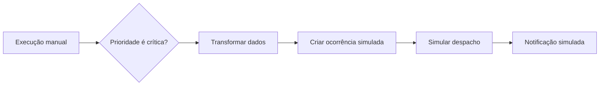

# Guia detalhado — Workflow simulado de Triagem de ocorrência crítica

**Versão de referência:** 1.14.3  
**Módulo:** Integrações & Workflows  
**Modo de operação:** **SIMULAÇÃO / MOCK**

> Este guia configura o primeiro workflow apresentado no manual: **Triagem de ocorrência crítica**. O objetivo é validar o desenho de uma futura automação sem criar ocorrência real, despachar equipe ou viatura, enviar notificação, chamar API externa, publicar webhook ou armazenar credencial.

## 1. Resultado que será modelado

O fluxo representa a intenção operacional de receber uma entrada manual, identificar uma prioridade crítica, organizar um campo de referência, registrar a criação de uma ocorrência de teste, selecionar uma estratégia de despacho e registrar uma notificação interna simulada.

Na versão atual, o diagrama é um **modelo de processo** e o executor grava as etapas de forma determinística. A condição é validada e preservada na definição, mas ainda não recebe payload operacional real nem executa ramificações externas “sim” e “não”. Portanto, conecte os nós em uma sequência única e utilize a execução manual apenas para validar estrutura, auditoria, estados e logs.

| Etapa | Objetivo no processo futuro | Comportamento atual |
|---|---|---|
| Execução manual | Receber o evento que inicia a triagem | Cria uma entrada de teste controlada |
| Condição / IF | Identificar prioridades críticas | Valida e guarda a regra no workflow |
| Transformar dados | Padronizar campos da ocorrência | Registra o mapeamento configurado |
| Criar ocorrência | Incluir caso crítico no despacho | Apenas representa uma criação simulada |
| Simular despacho | Escolher uma estratégia de atendimento | Não altera equipes, viaturas ou atribuições reais |
| Notificação simulada | Comunicar a situação ao canal definido | Registra uma saída, sem enviar mensagem |

## 2. Pré-requisitos de acesso

Antes de criar o fluxo, confirme que a conta possui permissões de visualização e gestão de workflows. A publicação exige a permissão de ativação/publicação, e a execução manual exige a permissão de executar workflows. Caso algum botão não seja exibido, um administrador deve revisar o perfil em **Administração > Perfis e Permissões**.

| Ação | Permissão de referência |
|---|---|
| Abrir lista e detalhes | `workflow.view` e/ou `integrations.view` |
| Criar e editar | `workflow.create` e `workflow.edit` |
| Publicar ou desativar | `workflow.activate` |
| Excluir | `workflow.delete` |
| Executar e reprocessar | `workflow.execute` |
| Consultar logs relacionados | `logs.view` |

## 3. Criar o cadastro do workflow

1. No menu lateral, acesse **Integrações** e, em seguida, **Workflows**.
2. Selecione **Novo workflow**.
3. Preencha o nome como **Triagem de ocorrência crítica**.
4. Use uma descrição objetiva, por exemplo: `Valida a estrutura simulada de triagem, despacho e comunicação para ocorrências críticas.`
5. Salve como **rascunho**.
6. Na lista, abra a ação **Editar no builder** ou equivalente para entrar no canvas visual.

Nesse momento o workflow existe, mas ainda não pode ser considerado pronto. O rascunho permite montar e revisar o grafo sem disponibilizá-lo para execução.

## 4. Montar os nós no canvas

Adicione os seis nós abaixo pela paleta do editor. A posição na tela não altera a execução, mas uma organização da esquerda para a direita facilita a revisão por outras pessoas.

| Ordem | Tipo de nó | Rótulo recomendado | Configuração a preencher |
|---:|---|---|---|
| 1 | Execução manual | `Entrada para triagem crítica` | Campo de entrada: `entrada_triagem_critica` |
| 2 | Condição / IF | `Prioridade é crítica` | Campo: `prioridade`; operador: `É igual a`; valor: `critica` |
| 3 | Transformar dados | `Gerar referência da ocorrência` | Origem: `ocorrencia.codigo`; destino: `referenciaOcorrencia` |
| 4 | Criar ocorrência | `Criar ocorrência crítica simulada` | Categoria: `Ocorrência crítica simulada`; prioridade: `Crítica` |
| 5 | Simular despacho | `Selecionar resposta para teste` | Estratégia: `Primeira equipe disponível` |
| 6 | Notificação simulada | `Avisar painel interno` | Canal: `Painel interno`; mensagem: `Triagem crítica simulada para {{ocorrencia.codigo}}` |

### 4.1. Configurar o gatilho manual

Selecione o nó **Entrada para triagem crítica**. No painel de configuração, informe `entrada_triagem_critica` em **Campo de entrada**. Esse valor nomeia a entrada de teste e não cria um formulário externo, webhook ou evento automático.

### 4.2. Configurar a condição

No nó **Prioridade é crítica**, informe os seguintes valores:

| Campo | Valor |
|---|---|
| Campo avaliado | `prioridade` |
| Operador | `É igual a` |
| Valor de comparação | `critica` |

Use o valor sem acento, `critica`, porque ele serve como valor técnico de comparação. O rótulo visual pode continuar com acento. A condição documenta a regra de negócio desejada: somente uma ocorrência classificada como crítica deverá seguir para despacho e comunicação em uma futura integração produtiva.

### 4.3. Configurar a transformação

Selecione **Gerar referência da ocorrência** e mapeie `ocorrencia.codigo` para `referenciaOcorrencia`. O mapeamento deixa explícito como um identificador interno poderá ser transportado para um futuro sistema de destino, sem criar campos novos na ocorrência real.

### 4.4. Configurar a criação de ocorrência simulada

No nó **Criar ocorrência crítica simulada**, defina a categoria como `Ocorrência crítica simulada` e a prioridade como **Crítica**. O termo “criar” descreve a intenção futura do processo; nesta versão, nenhuma tabela operacional recebe uma ocorrência nova a partir do workflow.

### 4.5. Configurar o despacho simulado

No nó **Selecionar resposta para teste**, escolha **Primeira equipe disponível**. Essa escolha registra a estratégia que será analisada futuramente. Ela não consulta disponibilidade real, não atribui recurso e não modifica jornadas, equipes ou viaturas.

### 4.6. Configurar a notificação simulada

No nó **Avisar painel interno**, escolha o canal **Painel interno** e informe a mensagem `Triagem crítica simulada para {{ocorrencia.codigo}}`. A mensagem é conservada como template de teste e o placeholder não é resolvido contra dados reais nesta etapa.

## 5. Conectar e validar o grafo

Crie cinco conexões, sempre do nó de origem para o nó seguinte:

1. `Entrada para triagem crítica` → `Prioridade é crítica`.
2. `Prioridade é crítica` → `Gerar referência da ocorrência`.
3. `Gerar referência da ocorrência` → `Criar ocorrência crítica simulada`.
4. `Criar ocorrência crítica simulada` → `Selecionar resposta para teste`.
5. `Selecionar resposta para teste` → `Avisar painel interno`.

O editor impede conexão de um nó para ele próprio e alerta sobre nós sem entrada, conexões apontando para nós removidos ou ausência de gatilho. Corrija erros antes de salvar; avisos também devem ser avaliados, pois podem indicar um desenho incompleto.

| Verificação | Resultado esperado |
|---|---|
| Há ao menos um nó | Sim, há seis |
| Há gatilho | Sim, `Execução manual` |
| Todos os nós têm configuração obrigatória | Sim |
| Há conexões inválidas ou para si próprio | Não |
| Há nós desconectados | Não |
| Metadado de modo | Permanece `simulacao` |

Selecione **Salvar**. O AXE Dispatch cria uma nova versão auditável da definição, preservando a versão anterior caso exista. Depois de salvar, feche e reabra o builder para confirmar que as configurações e conexões foram persistidas corretamente.

## 6. Publicar com segurança

Retorne à lista ou ao detalhe do workflow e selecione **Publicar**. A publicação torna o fluxo elegível para execução simulada; ela não coloca endpoint em produção, não ativa conectores nem envia dados para terceiros.

Antes de confirmar, use esta revisão operacional:

| Pergunta | Resposta necessária |
|---|---|
| O nome deixa claro que se trata de triagem crítica? | Sim |
| Há apenas dados de teste e nenhuma informação sigilosa nos campos? | Sim |
| O fluxo tem gatilho, regra, transformação e saídas simuladas? | Sim |
| Não há token, senha, chave ou certificado nas descrições? | Sim |
| O responsável pelo processo revisou a estratégia de despacho? | Sim |

## 7. Executar o cenário de sucesso

1. Abra **Integrações > Execuções** ou use a ação **Executar** a partir do workflow publicado.
2. Confirme a execução manual em modo de simulação. Não habilite a opção de falha controlada neste primeiro teste.
3. Aguarde o estado evoluir de **Pendente** para **Em execução** e, em seguida, **Concluída**.
4. Abra **Detalhes** da execução para conferir as seis etapas, sua ordem, duração e os dados sanitizados do teste.
5. Acesse **Logs** e confirme os registros correspondentes, sem tokens, senhas ou payloads sensíveis.
6. Acesse **Log de operações** e confira os eventos auditáveis de criação, publicação e execução.

O teste é considerado aprovado quando a execução aparece como concluída, todas as etapas foram registradas e nenhuma ocorrência, equipe, viatura, e-mail ou webhook real foi alterado ou acionado.

## 8. Executar uma falha controlada e testar retry

Depois do cenário de sucesso, execute novamente o workflow e selecione a opção de **falha controlada** na confirmação. Isso testa o tratamento operacional de problemas sem depender de fornecedor externo.

| Etapa | Ação | Resultado esperado |
|---|---|---|
| 1 | Criar execução com falha controlada | Execução termina em **Falha** |
| 2 | Abrir detalhes e logs | Mensagem de falha é registrada de forma sanitizada |
| 3 | Usar **Reprocessar** | Nova tentativa é criada e encadeada à anterior |
| 4 | Repetir quando necessário | O histórico das tentativas anteriores é preservado |
| 5 | Atingir o limite de três tentativas | Última tentativa segue para **Dead-letter** |

Não reprocese uma falha sem antes registrar por que ela ocorreu e qual ajuste é esperado. Mesmo sendo uma simulação, esse hábito evita levar um processo mal definido para uma integração produtiva.

## 9. O que validar com a área operacional

O workflow configura a estrutura técnica; a área operacional deve validar a regra de negócio. Recomenda-se confirmar quem classifica “crítica”, quais campos são obrigatórios, qual equipe deveria ser escolhida, qual canal receberia o alerta e quem acompanha falhas.

| Decisão a validar | Exemplo de pergunta |
|---|---|
| Critério de criticidade | `critica` será informado por operador, integração ou regra de SLA? |
| Regra de exceção | O que ocorre quando a prioridade não é crítica? |
| Seleção de equipe | A primeira disponível é adequada ou deve haver competência, distância e turno? |
| Comunicação | O painel interno é suficiente ou será necessário e-mail, aplicativo ou webhook? |
| Responsabilidade | Quem pode reprocessar e quem aprova mudanças no fluxo? |

## 10. Limites e próximo passo técnico

Este workflow é o **protótipo seguro** de uma automação. Para transformá-lo em processo produtivo, será necessário implementar avaliação real de payload e ramificações, idempotência, integração com ocorrências, algoritmo de seleção de recurso, cofre de segredos, allowlist de rede, autenticação externa, assinatura de webhooks, limites de requisição, monitoramento e plano de reversão.

Até que esses controles existam e sejam homologados, mantenha o fluxo em **SIMULAÇÃO / MOCK** e não utilize dados de produção nos textos, placeholders ou documentos importados.
