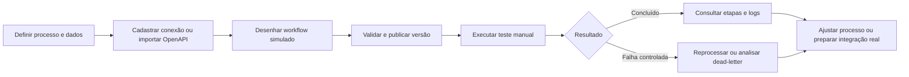

# Manual de Integrações & Workflows — AXE Dispatch

**Versão de referência:** 1.14.2  
**Público:** administradores, gestores operacionais, responsáveis por processos e equipe técnica.  
**Estado do módulo:** **SIMULAÇÃO / MOCK**.

> O módulo permite desenhar, validar e testar processos de integração sem enviar requisições a fornecedores, publicar endpoints, coletar segredos ou alterar recursos operacionais reais por meio dos workflows.

## 1. Para que serve

Integrações & Workflows é a área em que a operação pode preparar automações futuras de forma controlada. Ela reúne o desenho de workflows, a fila de execuções simuladas, conexões de referência, webhooks não publicados, placeholders de credenciais, logs internos e o catálogo técnico OpenAPI.

O objetivo atual é **reduzir risco antes de uma integração real**. Assim, a equipe pode validar o fluxo, seus campos, suas regras, seus responsáveis e seu histórico de execução sem depender de uma API externa durante a etapa de desenho.

| Recurso | O que permite fazer agora | O que não faz nesta versão |
|---|---|---|
| Workflows | Criar, editar, versionar, publicar e validar fluxos simulados | Disparar automação em sistemas externos |
| Execuções | Rodar testes manuais, registrar etapas e reprocessar falhas controladas | Executar jobs reais em fornecedores |
| Conexões | Documentar endpoints de referência e validar formato seguro de URL | Fazer chamadas HTTP |
| Webhooks | Definir método, caminho e workflow associado | Publicar rota ou receber tráfego da internet |
| Credenciais | Registrar o lugar e o tipo de credencial necessário | Receber, visualizar ou armazenar segredos |
| Logs | Consultar eventos internos sanitizados | Exibir tokens, chaves ou payloads sensíveis |
| API Docs / OpenAPI | Importar contratos e gerar metadados de conectores simulados | Criar API REST pública ou consumir a API importada |

## 2. Quem pode acessar

O acesso é controlado pelo modelo de **RBAC** do AXE Dispatch. A interface pode ocultar ações sem permissão e o servidor valida todas as operações novamente.

| Ação | Permissão esperada | Uso recomendado |
|---|---|---|
| Consultar o módulo | Permissão de visualização de integrações/workflows | Gestores, auditores e responsáveis pelo processo |
| Criar ou alterar workflow | Permissão de gestão de workflows | Administradores e analistas de processos autorizados |
| Publicar workflow | Permissão de publicação de workflows | Responsável técnico ou gestor designado |
| Executar e reprocessar | Permissão de execução de workflows | Equipe de testes e operação autorizada |
| Cadastrar conexões, webhooks e placeholders | Permissão específica do recurso | Administradores de integração |
| Consultar logs e OpenAPI | Permissão de leitura técnica | Auditoria, desenvolvimento e gestão técnica |

Se uma tela informar acesso negado, revise o perfil, as permissões efetivas e, quando aplicável, o escopo organizacional da pessoa em **Administração > Perfis e Permissões**.

## 3. Visão geral do fluxo recomendado

O caminho mais seguro é documentar primeiro a integração, desenhar o workflow, validar as regras e somente depois executar simulações. O diagrama abaixo representa o ciclo atual.

## 4. Criando um workflow simulado

1. Acesse **Integrações > Workflows** e crie um novo workflow.
2. Informe um nome que explique o objetivo, por exemplo, `Triagem de ocorrência crítica`.
3. Abra o **Workflow Builder** e adicione os nós necessários ao canvas.
4. Conecte os nós na ordem desejada, configure seus campos e corrija erros ou avisos apresentados pela validação.
5. Salve a definição. Cada alteração relevante é versionada e pode ser auditada.
6. Publique somente depois de validar o fluxo. A publicação continua em modo de simulação.

### Nós disponíveis

| Nó | Finalidade | Exemplos de configuração |
|---|---|---|
| Execução manual | Inicia um teste controlado | Nome do objeto de entrada |
| Condição / IF | Divide o fluxo conforme uma regra | Campo `prioridade`, operador e valor `alta` |
| Transformar dados | Mapeia um campo de entrada para uma saída | `ocorrencia.codigo` → `referenciaOcorrencia` |
| Criar ocorrência | Representa a criação de uma ocorrência simulada | Categoria e prioridade simuladas |
| Simular despacho | Registra uma estratégia de despacho sem alterar recursos | Escolha manual ou primeira equipe disponível |
| Notificação simulada | Registra uma saída que seria enviada | Canal interno, e-mail simulado ou webhook simulado |

> A simulação de despacho não muda equipe, viatura ou ocorrência real. A notificação simulada também não envia e-mail, mensagem ou webhook.

## 5. Executando e acompanhando testes

Após publicar um workflow, use a ação **Executar** para criar uma execução manual. O sistema registra uma fila persistida e cria etapas determinísticas para cada nó do fluxo.

| Estado | Significado | Próxima ação recomendada |
|---|---|---|
| Pendente | Execução criada e aguardando processamento | Aguarde a atualização ou recarregue a lista |
| Em execução | Etapas sendo processadas na simulação | Abra os detalhes para acompanhar |
| Concluída | Todas as etapas foram concluídas | Revise logs e valide o resultado de negócio |
| Falha | Uma falha controlada foi registrada | Analise o erro e use **Reprocessar** se autorizado |
| Dead-letter | Limite de tentativas atingido; histórico preservado | Corrija a causa antes de novo reprocessamento manual |
| Cancelada | Execução interrompida de forma controlada | Consulte o histórico e a auditoria |

Na tela **Execuções**, o botão **Detalhes** mostra as etapas, duração, estado e logs internos. O reprocessamento cria uma nova tentativa encadeada ao histórico anterior; não apaga a execução que falhou.

## 6. Conexões, webhooks e credenciais

### Conexões simuladas

Uma conexão representa um futuro fornecedor ou sistema de destino. Cadastre um código estável, nome, tipo, URL HTTPS de referência e descrição. A URL passa por validação defensiva contra SSRF, mas permanece apenas como referência: **nenhuma chamada é feita**.

### Webhooks simulados

Um webhook documenta como o AXE Dispatch poderá receber um evento no futuro. Informe nome, método `POST`, `PUT` ou `PATCH`, caminho e workflow opcionalmente associado. O caminho não fica público e não recebe tráfego nesta versão.

### Cofre de credenciais

O cofre está preparado para o desenho de uma futura solução criptografada. Hoje, crie somente **placeholders**, como “API key do ERP” ou “Certificado do parceiro”. Não informe token, senha, certificado, chave privada ou qualquer segredo no nome ou na descrição.

## 7. API Docs / OpenAPI

O catálogo OpenAPI interno descreve contratos técnicos do próprio AXE Dispatch. Ele é uma referência para planejamento; os caminhos exibidos não equivalem a uma API REST pública.

Para analisar a especificação de um parceiro, acesse **API Docs / OpenAPI** e siga este processo:

1. Carregue um arquivo JSON ou YAML de até **1 MB**, ou cole o conteúdo no editor.
2. Selecione a detecção automática ou o formato correspondente.
3. Use **Analisar e importar em simulação**.
4. Revise as operações importadas e seus métodos/caminhos.
5. Use **Testar** para registrar um teste de contrato interno, sem tráfego externo.
6. Use **Gerar conector** quando desejar criar metadados de conexão para o workflow futuro.

O conteúdo é analisado localmente, campos sensíveis são mascarados e o documento permanece associado ao modo de simulação.

## 8. Logs e auditoria

Há duas camadas complementares de rastreabilidade:

| Camada | Conteúdo |
|---|---|
| Logs de integração | Eventos internos, nível, origem, mensagem e dados sanitizados de execução/simulação |
| Log de operações | Ações administrativas e operacionais auditáveis, como criação, edição, publicação, execução, retry e mudanças de recursos |

Ao abrir dados de um log, procure somente informações mascaradas. Caso um token ou segredo apareça em tela, interrompa o uso do conteúdo e comunique a administração para revisão de segurança.

## 9. Regras de segurança do modo atual

> Enquanto o selo **SIMULAÇÃO / MOCK** estiver visível, o módulo não deve ser usado como canal de integração real.

| Regra | Como o AXE Dispatch se comporta |
|---|---|
| Saída de rede | Conexões e conectores não fazem requisições externas |
| Entrada de rede | Webhooks não são publicados |
| Segredos | A interface não solicita nem persiste tokens, senhas ou chaves |
| URLs | Endpoints de referência passam por validação anti-SSRF |
| Dados técnicos | Logs e contratos aplicam mascaramento defensivo |
| Auditoria | Operações relevantes preservam registro de autor, ação e contexto |

## 10. Como sair da simulação no futuro

A ativação de fornecedores reais deve ser tratada como um projeto de segurança e não como uma simples troca de botão. Antes de habilitar tráfego externo, recomenda-se aprovar formalmente o parceiro, classificar dados, configurar cofre de segredos, limitar destinos permitidos, implementar assinatura de webhook, rate limit, timeout, retry com idempotência, monitoramento e plano de reversão.

| Pré-requisito | Evidência mínima esperada |
|---|---|
| Aprovação do parceiro | Responsável, finalidade e contrato de dados definidos |
| Credenciais | Secret manager criptografado e rotação documentada |
| Rede | Allowlist de destinos, DNS/HTTPS validados e bloqueio de redes privadas |
| Entrada webhook | Assinatura verificada, proteção contra replay e limite de requisições |
| Confiabilidade | Timeout, circuit breaker, idempotência e fila de falhas |
| Observabilidade | Métricas, alerta, correlação e logs sem segredos |
| Governança | Aprovação de mudança, auditoria e procedimento de desligamento |

## 11. Solução de problemas

| Sintoma | Causa provável | Ação recomendada |
|---|---|---|
| Botão de criação não aparece | Permissão insuficiente | Revisar RBAC e perfil efetivo |
| Workflow não publica | Definição com erro ou sem gatilho | Corrigir conexões, configurações e avisos do builder |
| Execução em dead-letter | Tentativas simuladas esgotadas | Abrir detalhes, ajustar o fluxo e reprocessar somente quando autorizado |
| URL de conexão rejeitada | Endereço não atende às regras de segurança | Usar URL HTTPS pública de referência; não usar IP privado ou loopback |
| Importação OpenAPI falha | Formato, tamanho ou estrutura inválidos | Validar JSON/YAML e limitar o arquivo a 1 MB |
| Log sem detalhe de segredo | Comportamento esperado | Nunca tente contornar o mascaramento; registre apenas o metadado necessário |

## 12. Checklist para o primeiro piloto de simulação

1. Defina o caso de uso e o responsável operacional.
2. Cadastre a conexão de referência sem informar segredo.
3. Importe ou documente o contrato OpenAPI aplicável.
4. Modele o workflow com gatilho, regra, transformação e saída simulada.
5. Publique e execute pelo menos um caminho de sucesso e uma falha controlada.
6. Revise execuções, logs e o Log de operações.
7. Registre as decisões antes de solicitar a habilitação de integração real.

## Glossário

| Termo | Definição |
|---|---|
| Workflow | Fluxo visual de etapas e regras de um processo |
| Conector | Metadado que representa uma futura comunicação com sistema externo |
| Webhook | Rota que poderá receber um evento de outro sistema quando publicada no futuro |
| Retry | Nova tentativa encadeada a uma execução que falhou |
| Dead-letter | Fila que retém uma falha após esgotar tentativas permitidas |
| SSRF | Risco de induzir o servidor a chamar endereços internos ou não autorizados |
| OpenAPI | Especificação que documenta contratos de APIs |
